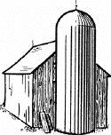

# Cognitiones Privatae

Hallo Jörg. Das wird vielleicht einmal mein ganz privater Evernote-Ersatz. Raus aus den Datensilos dieser Welt!

## Commands

* `mkdocs new [dir-name]` - Create a new project.
* `mkdocs serve` - Start the live-reloading docs server.
* `mkdocs build` - Build the documentation site.
* `mkdocs help` - Print this help message.

## Project layout

    mkdocs.yml    # The configuration file.
    docs/
        index.md  # The documentation homepage.
        ...       # Other markdown pages, images and other files.
